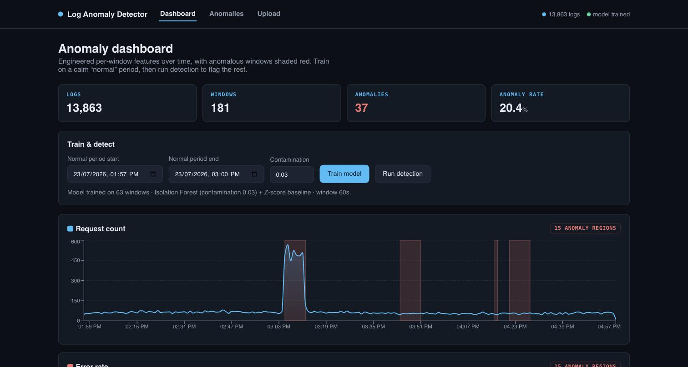

# 🚨 Log Anomaly Detector

An end-to-end ML pipeline that **ingests application logs, learns what "normal"
looks like, and flags anomalies** — traffic spikes, error bursts, and latency
regressions — using an **Isolation Forest** plus a **Z-score statistical
detector**, with a comparison mode that shows where the two agree.

Python data pipeline (parser → features → models) + FastAPI backend + React
(Recharts) dashboard. No LLMs — this is classic, interpretable ML.



> **Works out of the box with zero setup.** A synthetic log generator plants
> realistic anomalies, and the backend auto-loads, trains, and detects on first
> boot — so `docker compose up` lands on a populated dashboard. Bring your own
> logs (Apache/Nginx, JSON, or syslog) any time via the upload page.

---

## What it does

1. **Parse** heterogeneous logs into a common shape — `timestamp, level, source,
   message` + extracted `status_code`, `response_time_ms`, `ip`.
2. **Engineer** rolling per-window features: request count, error rate, avg
   response time, unique IPs, 5xx/2xx ratio, and **message-template entropy**
   (which spikes when a burst of new messages appears).
3. **Detect** anomalies two ways and compare them:
   - **Isolation Forest** trained on a "normal" period (scikit-learn).
   - **Z-score** — flag any window > 3σ from the training baseline, and report
     *which* metric tripped.
4. **Review & label** flagged windows as true/false positive to build a labeled
   set and measure **precision** over time.

---

## The pipeline (the ML core)

```
logs ──parser──▶ ParsedLog[] ──features──▶ per-window matrix ──┬─▶ IsolationForest ─┐
 (apache/nginx/                (request_count, error_rate,     │                    ├─▶ compare ─▶ anomalies
  json/syslog)                  avg_rt, unique_ips,            └─▶ Z-score baseline ┘        (which metric,
                                 5xx:2xx, msg_entropy)                                         which detector)
```

- **`pipeline/parser.py`** — format auto-detection + normalization for Apache/
  Nginx access logs, JSON structured logs, and RFC 3164 syslog. Levels are
  derived from status codes when not explicit.
- **`pipeline/features.py`** — buckets logs into fixed windows and computes the
  six signals above; message entropy is Shannon entropy over templatized messages.
- **`pipeline/ml.py`** — `train` (Isolation Forest + baseline stats), `detect`
  (both detectors + agreement), `comparison_summary`, `evaluate`
  (precision/recall/F1), and joblib persistence.

---

## Run with Docker Compose

```bash
cd log-anomaly-detector
docker compose up --build
```

The backend seeds synthetic logs, trains on the calm opening period, and runs
detection on first boot. Then open:

| Service      | URL                          |
| ------------ | ---------------------------- |
| Frontend     | http://localhost:8080        |
| Backend API  | http://localhost:8000/api    |
| API docs     | http://localhost:8000/docs   |

### Local dev (no Docker)

```bash
# Backend (Python 3.11–3.14)
python -m venv .venv && source .venv/bin/activate
pip install -r requirements.txt
python scripts/generate_logs.py            # -> sample_data/app_logs.jsonl
python -m scripts.bootstrap                # ingest + train + detect
uvicorn api.main:app --reload              # http://localhost:8000

# Frontend
cd frontend
npm install && cp .env.example .env
npm run dev                                # http://localhost:5173
```

---

## Synthetic data

`scripts/generate_logs.py` produces a mostly-normal traffic timeline with three
planted anomalies — a **traffic spike**, an **error burst** (with new error
message templates), and a **latency spike** — so the whole thing is demoable
without real production logs.

```bash
python scripts/generate_logs.py --minutes 240 --rate 80        # more data
python scripts/generate_logs.py --format nginx                 # nginx access logs
```

A companion `*_truth.json` records the injected anomaly windows for reference.

---

## Running the tests

```bash
pip install -r requirements.txt
pytest        # SQLite + in-process; no services needed
```

`pytest.ini` enforces `--cov-fail-under=85` (current coverage **~95%**). Tests
cover all four parser formats, the feature math (entropy, error-rate/ratio
spikes), Isolation Forest + Z-score detection and their comparison,
precision/recall/F1, joblib round-trips, and the full API flow (upload → train →
detect → label → evaluate). CI runs the suite and builds the frontend.

---

## API reference

Base URL `http://localhost:8000`, everything under **`/api`**.

| Method | Path | Notes |
| ------ | ---- | ----- |
| POST | `/api/logs/upload` | multipart `file`; parse (auto-detect) + store |
| POST | `/api/train` | `{normal_start?, normal_end?, window_seconds?, contamination?}` → model summary |
| POST | `/api/detect` | `{start?, end?, z_threshold?}` → flagged windows + detector comparison |
| GET | `/api/anomalies` | list detected anomalies (`?label=`, `?detector=`) |
| POST | `/api/anomalies/{id}/label` | `{label: true_positive\|false_positive}` |
| GET | `/api/metrics/timeseries` | per-window features over time (for charts) |
| GET | `/api/evaluation` | anomaly rate, labeled counts, precision |
| GET | `/api/status` | log count, range, model summary |

**Example:**

```bash
curl -F "file=@sample_data/app_logs.jsonl" localhost:8000/api/logs/upload
curl -X POST localhost:8000/api/train -H 'Content-Type: application/json' \
  -d '{"contamination":0.03}'
curl -X POST localhost:8000/api/detect -H 'Content-Type: application/json' -d '{}'
```

---

## Design notes

- **Two detectors on purpose.** Isolation Forest catches multivariate oddness;
  the Z-score detector is cheap and *explains itself* (which metric, how many σ).
  The comparison view surfaces where a learned model and simple statistics agree
  — high agreement is high confidence.
- **Training on a representative "normal" window matters.** Train on a calm
  stretch; the baseline it learns is what everything else is judged against. The
  UI defaults the normal range to the first third of the data.
- **Interpretable anomalies.** Every flag records the abnormal features and their
  z-scores, so an on-call engineer sees *why* a window tripped, not just that it did.
- **Cohesive datetimes.** Timestamps are stored as naive UTC and rendered as UTC
  everywhere, so charts, inputs, and anomaly times line up for any viewer.
- **SQLite + joblib** keep the footprint tiny; the pipeline modules are pure and
  unit-tested independently of the API.
